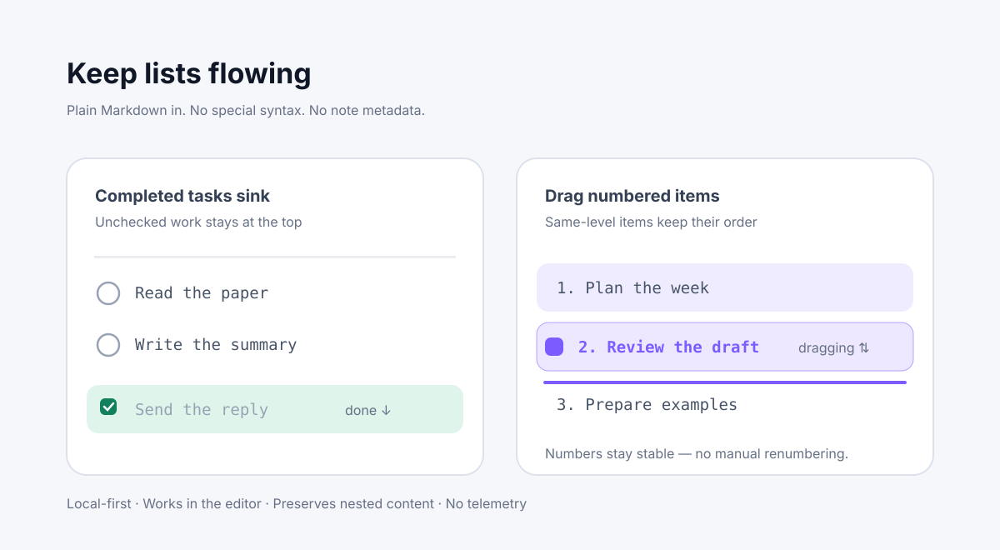

# Checklist Flow

<div align="center">

<picture>
  <source media="(prefers-color-scheme: dark)" srcset="docs/assets/hero.svg">
  
</picture>

**A calmer way to organize tasks and ordered lists in Obsidian.**

[](https://github.com/hemashishi12/obsidian-checklist-flow/releases)
[](https://obsidian.md)
[](#development)
[](#development)
[](LICENSE)

[Install](#quick-start) · [Usage](#usage) · [Settings](#settings) · [Privacy](#privacy) · [Contributing](#contributing)

Completed tasks move out of the way. Numbered lists stay numbered.

</div>

## Why Checklist Flow?

Obsidian lists are excellent for thinking, but long checklists can become noisy as work changes. Checklist Flow keeps the editor calm: completed tasks sink below unfinished work, and same-level items can be rearranged with a direct press-and-drag gesture.

Everything stays in ordinary Markdown. There is no special syntax, no database, and no metadata hidden in your notes.

## Highlights

| | Capability | What you get |
| --- | --- | --- |
| ✅ | **Auto-sink completed tasks** | Finished work moves below unfinished siblings in the same contiguous list. |
| 🖐️ | **Drag task checkboxes** | Reorder same-level tasks while child notes and sublists stay attached. |
| 🔢 | **Drag ordinary list numbers** | Reorder numbered lists by pressing the number, not just checkboxes. |
| 🔢 | **Stable numbering** | A list starting at `5.` remains anchored to `5.` after sorting or dragging. |
| 🧱 | **Markdown-native** | Works with regular `- [ ]`, `- [x]`, `1.`, and nested Markdown blocks. |
| 🔒 | **Local and private** | No account, telemetry, network request, or note-content collection. |

## Quick start

### Requirements

- Obsidian `1.5.0` or later
- A desktop or mobile Obsidian vault

### Install from a release

1. Open the [latest release](https://github.com/hemashishi12/obsidian-checklist-flow/releases/latest).
2. Download `main.js`, `manifest.json`, and `styles.css`.
3. Create this folder in your vault:

   ```text
   <vault>/.obsidian/plugins/checklist-flow/
   ```

4. Copy the three downloaded files into that folder.
5. In Obsidian, open **Settings → Community plugins**, refresh the list, and enable **Checklist Flow**.

### Install with BRAT

If you already use [BRAT](https://github.com/TfTHacker/obsidian42-brat), add this repository:

```text
hemashishi12/obsidian-checklist-flow
```

## Usage

### Complete and auto-sink tasks

Use ordinary Markdown tasks:

```markdown
- [ ] Read the paper
- [x] Send the reply
- [ ] Write the summary
```

With **auto-sink** enabled, checking *Send the reply* becomes:

```markdown
- [ ] Read the paper
- [ ] Write the summary
- [x] Send the reply
```

Only sibling items in the same contiguous list are reordered. Nested notes and child lists remain attached to their parent.

### Drag to reorder

Press and hold a task checkbox:

```markdown
- [ ] First
- [ ] Second
- [ ] Third
```

Or press and hold an ordinary ordered-list number:

```markdown
1. First
2. Second
3. Third
```

While dragging:

- an insertion line shows the drop position;
- the dragged line remains highlighted;
- the cursor changes to a closed hand;
- text selection is suppressed until the gesture ends.

A quick click still toggles a checkbox. List numbers have no hover effect and remain visually unchanged until a press-and-drag gesture starts.

## Supported scope

| Works | Not covered |
| --- | --- |
| Regular Markdown task lines | Reading-view rendered checklists |
| Ordinary numbered-list lines | Tasks plugin query results |
| Same-level sibling items | Kanban cards, tables, and canvas cards |
| Nested blocks attached to a parent task/list | Content inside fenced code blocks |

Checklist Flow intentionally edits only the affected contiguous list block. That keeps behavior predictable in notes that mix outlines, quotes, code, and tasks.

## Settings

Open **Settings → Community plugins → Checklist Flow**.

| Setting | Default | Description |
| --- | --- | --- |
| **Auto-sink completed tasks** | On | Move completed tasks below unfinished siblings. |
| **Drag from checkbox or number** | On | Enable press-and-drag reordering. |
| **Done status characters** | `xX` | Checkbox values treated as completed. |

## Privacy

Checklist Flow runs locally inside Obsidian. It does **not**:

- collect note contents or usage analytics;
- make network requests;
- require an account or external service;
- add telemetry, tracking identifiers, or metadata to notes.

## Development

### Setup

```bash
npm install --no-audit --no-fund
```

### Commands

```bash
npm test
npx tsc --noEmit
npm run build
npm run dev
```

`npm run build` generates these files in the repository root:

```text
main.js
manifest.json
styles.css
```

Copy them into a folder named `checklist-flow` inside your vault’s `.obsidian/plugins/` directory to test a local build.

### Project layout

```text
src/
├── checklist.ts          # Pure Markdown parsing, sorting, and reordering
├── editor-extension.ts   # CodeMirror drag and auto-sink integration
├── main.ts               # Plugin lifecycle, commands, and settings
└── settings.ts           # Shared setting types and defaults
tests/
└── checklist.test.ts     # Markdown transformation behavior tests
docs/
└── assets/
    └── hero.svg          # Generic documentation illustration
```

## Releasing

1. Update `version` in `manifest.json`, `package.json`, and `package-lock.json`.
2. Run tests, type checking, and a production build.
3. Push a tag whose name exactly matches the manifest version (for example, `0.2.0`, without a `v` prefix).
4. GitHub Actions builds and creates a draft release with `main.js`, `manifest.json`, and `styles.css`.
5. Review the draft, add release notes, and publish it. The workflow also creates build provenance attestations.

## Contributing

Issues and pull requests are welcome. For behavior changes, please include tests covering Markdown edge cases such as indentation, nested blocks, blank-line boundaries, ordered numbering, and CRLF line endings.

1. Fork the repository.
2. Create a focused branch.
3. Add tests for new behavior.
4. Run `npm test` and `npx tsc --noEmit`.
5. Open a pull request with a short before/after description.

## License

[MIT](LICENSE)
